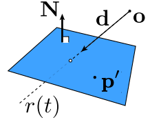
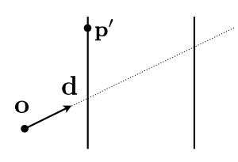

#### 1、三维
射线:
```js
R(t)=O+Dt
```

平面:
```js
(P-P')N = 0
```

射线与平面的交点:
```js
(O+Dt-P')N = 0
(O-P')N + DtN = 0
t = (P'-O)N/DN
```


$$
t = \frac{(p'-o)\cdot N}{d\cdot N}
$$

#### 2、二维

$$
t = \frac{p'_x-o_x}{d_x}
$$
