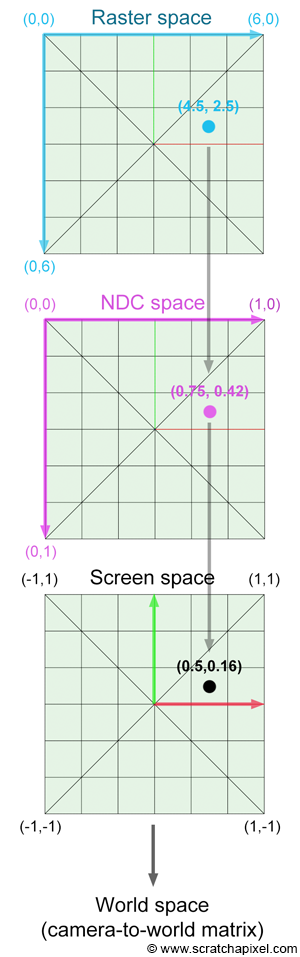
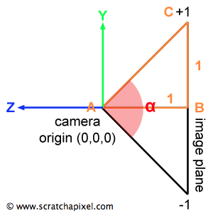

出处: https://www.scratchapixel.com/lessons/3d-basic-rendering/ray-tracing-generating-camera-rays/generating-camera-rays

### Whitted 风格光线追踪

#### 1、栅格空间到NDC空间
$$
\begin{array}{l}
PixelNDC_x = \dfrac{Pixel_x + 0.5}{ImageWidth}   \\ PixelNDC_y = \dfrac{Pixel_y + 0.5}{ImageHeight}
\end{array}
$$

- 光线追踪中的 NDC 空间(0~1)与光栅化世界中的 NDC空间(-1~1)不同
- 像素位置添加了一个小的偏移 (0.5)，希望相机光线穿过像素的中间

#### 2、NDC空间到屏幕空间
$$
\begin{array}{l}
PixelScreenx=2∗PixelNDCx−1 \\
PixelScreeny=1-2∗PixelNDCy
\end{array}
$$

- $PixelScreeny$ 对于位于x轴上方的像素为正，对于位于x轴下方的像素为负

还需要考虑纵横比:
$$
ImageAspectRatio=\dfrac{ImageWidth}{ImageHeight}
$$

那么:
$$
\begin{array}{l}
PixelCameraX = PixelScreenX * ImageAspectRatio \\
PixelCameraY = PixelScreenY
\end{array}
$$

#### 3、视角

- 目前为止,屏幕空间中定义的任何点的 y 坐标都在 [-1, 1] 范围内
- 图像平面距离相机原点 1 个单位

$$
\dfrac{α}{2} =
atan(\dfrac{对边}{邻边})=atan(1)=\dfrac{\pi}{4} = 45度
$$

也就是说:
$$
|BC| = tan(\dfrac{α}{2})
$$

最后:
$$
\begin{array}{l}
PixelCameraX = PixelScreenX * ImageAspectRatio *tan(\dfrac{α}{2})\\
PixelCameraY = PixelScreenY * tan(\dfrac{α}{2})
\end{array}
$$
