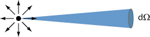
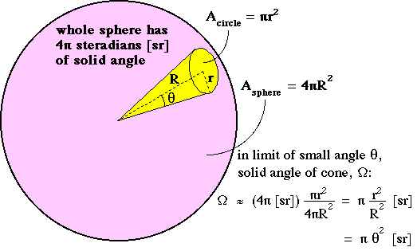

辐射度量学提供了一系列方便的概念来描述渲染中的光学问题，所以渲染中大量运用到这些符号(与物理含义)。渲染中的光学做了一些简化。
- 光线不会自相交
- 光线沿直线传播
- 光线是线性可加的
- 光线不会闪烁
- 光线保持能量守恒
- 衍射和干涉等波动光学的概念几乎不考虑

#### 1 Radiant Energy(辐射能)
电磁辐射(electromagnetic radiation)的能量，单位是焦耳 J.

$$
Q [J=Joule]
$$

#### 2 Radiant Flux/power(辐射通量/功率)
单位时间释放(emitted)、反射(emitted)、透射(transmitted)或接受(received)的能量。单位是W或lm.

$$
\Phi = \frac{dQ}{dt} [W=Watt],[lm=lumen]
$$

#### 3 Radiant Intensity(辐射强度)
- 量化光源发射能量的多少
- 描述空间中,不同方向辐射的能量
- 定义为每单位立体角的辐射通量
- 辐射方向为单位立体角的中心

$$
I(w) = \frac{d\Phi}{dw} [W/sr](瓦特/球面度)
$$

**立体角**定义:
- 一个半径为R的球体
- 一个与球体表面相交以形成半径为r的圆的圆锥体

https://omlc.org/classroom/ece532/class1/intensity.html

#### 4 Irradiance(辐照度)
- 量化**接收**光源能量的多少

$$
$$
