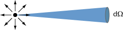

辐射度量学提供了一系列方便的概念来描述渲染中的光学问题，所以渲染中大量运用到这些符号(与物理含义)。渲染中的光学做了一些简化。
- 光线不会自相交
- 光线沿直线传播
- 光线是线性可加的
- 光线不会闪烁
- 光线保持能量守恒
- 衍射和干涉等波动光学的概念几乎不考虑

#### 1 Radiant Energy(辐射能)
电磁辐射(electromagnetic radiation)的能量，单位是焦耳 J.

$$
Q [J=Joule]
$$

#### 2 Radiant Flux/power(辐射通量/功率)
单位时间释放(emitted)、反射(emitted)、透射(transmitted)或接受(received)的能量。单位是W或lm.

$$
\Phi = \frac{dQ}{dt} [W=Watt],[lm=lumen]
$$

#### 3 Radiant Intensity(辐射强度)
- 量化光源发射能量的多少
- 描述空间中,不同方向辐射的能量
- 定义为每单位立体角的辐射通量
- 辐射方向为单位立体角的中心

$$
I(w) = \frac{d\Phi}{dw}
$$

单位是: $[W/sr](瓦特/球面度)$

**辐射强度**(Radiant Intensity)：是**单位立体角**(solid angle)由点光源发出的**功率**(power)。

**立体角**(Solid Angles)：球面上的投影面积与半径的平方之比
$$
\Omega = \frac{A}{r^2}
$$

#### 4 Irradiance(辐照度)
- 量化**接收**光源能量的多少

$$
E(x) = \frac{d \Phi}{ dA}
$$

**辐照度**(Irradiance) ：是每投影到单位面积入射到一个表面上一点的辐射通量(功率)。

#### 5 Radiance(辐射)

**辐射**(Radiance)是描述光在环境中的分布的基本场量.

**辐射**(Radiance)或**亮度**(luminance))：是指一个表面在**每单位立体角**、**每单位投影面积**上所发射(emitted)、反射(reflected)、透射(transmitted)或接收(received)的**辐射通量**(功率)。

$$
L(p,w) = \frac{d^2 \Phi (p,w)}{ d \omega dA cos \theta}
$$
